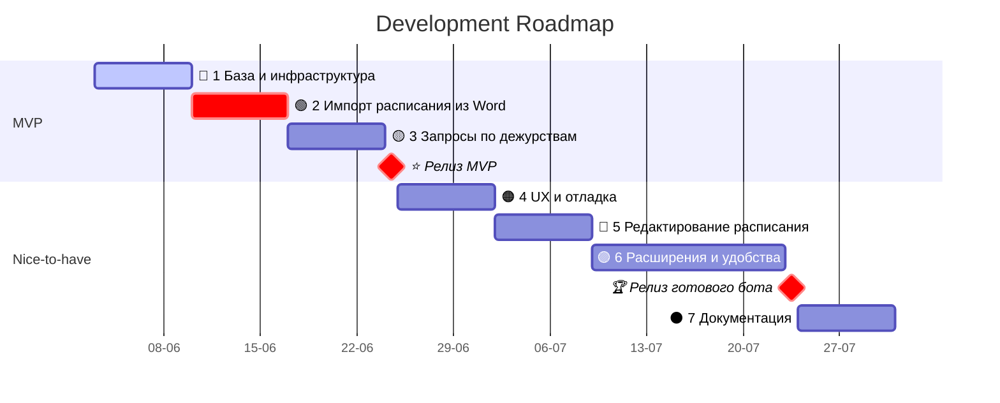

# Бот Данилыч


> Обложка сгенерирована ИИ: *ChatGPT (DALL·E)*.

---

[](https://wakatime.com/badge/user/45d08a79-2677-4493-83b7-77be5bfef3a9/project/b6d8a21b-5616-4c4b-a10c-0c612acb2fa2)

Знакомьтесь, это Данилыч — виртуальный бот-помощник в телеге для дорогих коллег по Дворцу Меншикова (Эрмитаж, С.-Петербург).

Разработан [Валерием Тропиным](https://tropin.one) в 2025 г.

---

## Development Roadmap

### Bot Wishlist

- Подключение к Redis и работа с базой данных (загрузка, чтение, обновление данных)
- Получение списка сотрудников отдела, имеющих право на взаимодействие с ботом
- Интеграция в групповые чаты (поддержка inline-режима и /команд в группах)
- Обработка пересланного сообщения с `.docx` файлом (график дежурств в виде таблицы)
- Парсинг таблицы в файле и формирование дежурств на месяц:
  - Извлечение даты и дежурного из таблицы
  - Сопоставление дежурных по инициалам и фамилии с базой данных сотрудников и их `Telegram ID`
  - Проверка полученных записей на конфликт с уже записанными в базу (приоритет для более новых)
- Запись полученного расписания в Redis (по дням месяца)
- Команды/запросы:
  - Кто дежурит сегодня
  - Кто дежурит в ближайшие `n` дней
  - Кто дежурит в указанные (будущие/прошлые) `n` дней
  - Когда я дежурю (мои ближайшие дежурства)
  - Какие дни дежурства у конкретного сотрудника
- Логгирование всех действий (получение файла, парсинг, ошибки, доступ и пр.)
- Адекватная обработка ошибок и уведомление пользователя при сбоях
- Проверка прав доступа для взаимодействия с ботом
- В будущем:
    - Возможность ручного редактирования расписания (если сотрудники поменялись дежурствами)
    - Возможность генерации/экспорта расписания в удобном виде
        - Сохранение личного расписания дежурств в виде изображения
    - Возможность включить напоминания о своих грядущих дежурствах (директ)
    - Возможность оставить заметку для следующего дежурного (директ)

### Спринты

Проект разбит на спринты, которые идут по приоритету:

🔵🟢🟡 **MVP** — минимально жизнеспособный продукт — охватывает спринты 1–3.

🟠🔴🟣⚫️ **Спринты 4–7** — дополнительные, *nice-to-have* фичи для улучшения и расширения бота.




#### 🔵 Спринт 1: База и инфраструктура

- [x] Подключение к Redis
- [ ] Получение списка авторизованных сотрудников
- [ ] Проверка прав доступа
- [ ] Интеграция в групповой чат
- [ ] Команда `/start`
- [x] Базовая конфигурация логирования (YAML)
- [ ] Метки по пользователю и чату при логировании
- [ ] Обработка ошибок без падений

#### 🟢 Спринт 2: Импорт расписания из Word

- [ ] Приём `.docx` файла через пересланное сообщение
- [ ] Парсинг таблицы с дежурствами (с нормализацией данных)
- [ ] Сопоставление ФИО с базой сотрудников
- [ ] Сохранение расписания в Redis
- [ ] Сохранение `file_id` файла расписания из TG (на случай, если нужно будет сравнить файлы)

#### 🟡 Спринт 3: Запросы по дежурствам

- [ ] Команда: кто дежурит **сегодня**
- [ ] Команда: дежурные в ближайшие `n` дней
- [ ] Команда: дежурные в указанные `n` дней
- [ ] Команда: мои дежурства
- [ ] Команда: дежурства другого сотрудника
- [ ] Логгирование действий и ошибок

#### ⭐️ **Milestone Fix Day: Релиз MVP-бота**

- [ ] Исправление багов

#### 🟠 Спринт 4: UX и отладка

- [ ] Улучшенная обработка ошибок и сообщений
- [ ] Псевдо-админка: лог неизвестных пользователей
- [ ] Отладочные команды (показать расписание, сотрудников и т.п.)

#### 🔴 Спринт 5: Редактирование расписания

- [ ] Команда для редактирования дежурного на дату
- [ ] Директ-сообщение бывшему дежурному о том, что его заменили
- [ ] Команда для удаления расписания месяца
- [ ] Повторный парсинг с перезаписью

#### 🟣 Спринт 6: Расширения и удобства

- [ ] Генерация личного расписания в виде изображения (Pillow? SVG? PNG?)
- [ ] Напоминания о дежурствах в личку (cron/apscheduler с фильтром по дате)
- [ ] Оставление заметок следующему дежурному (Redis Hash с ключом `note:{дата}`)
- [ ] Статистика: кто сколько дежурил (Redis sorted sets или простые подсчёты на лету)

#### 🏆 **Milestone Fix Day: Релиз готового бота в прод**

- [ ] Исправление багов

#### ⚫️ Спринт 7: Документация

- [ ] Команда `/help` и инструкция для пользователей бота
- [ ] Написать документацию к боту
- [ ] Оформить `README.md`
- [ ] Сделать репозиторий публичным


### Проектируемая структура бота

```
my_duty_bot/
├── bot/                         # Всё про самого бота
│   ├── __init__.py              # инициализация бота (экземпляр aiogram.Bot, Dispatcher)
│   ├── handlers/                # хендлеры и команды
│   │   ├── __init__.py
│   │   ├── admin.py             # обработка пересланных сообщений с таблицей
│   │   ├── general.py           # общие команды: кто сегодня, расписание и пр.
│   ├── services/                # бизнес-логика, работа с Redis, парсинг таблиц и т.п.
│   │   ├── __init__.py
│   │   ├── redis_client.py      # обёртка для работы с Redis
│   │   ├── parser.py            # функции парсинга вордовских таблиц
│   │   ├── schedule.py          # логика создания и обработки графиков дежурств
│   ├── utils.py                 # вспомогательные функции
│   ├── config.py                # конфиги и чтение из environs
├── main.py                      # точка входа, запускает бота
├── requirements.txt             # зависимости
├── .env                        # твои переменные окружения
└── README.md                    # документация
```
